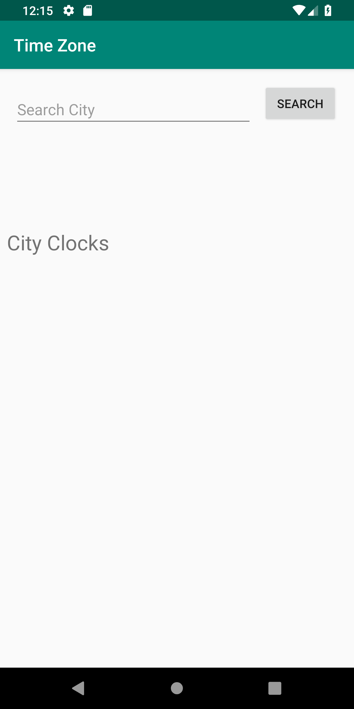
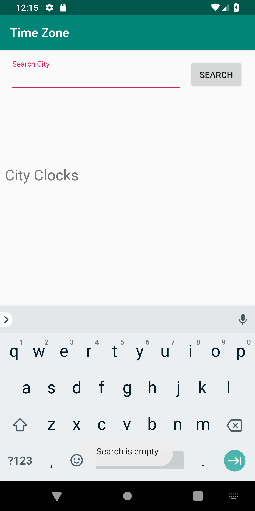
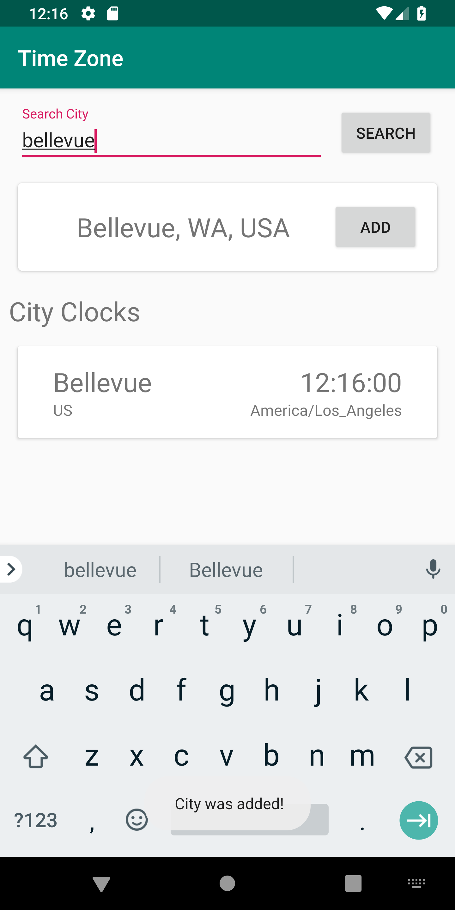
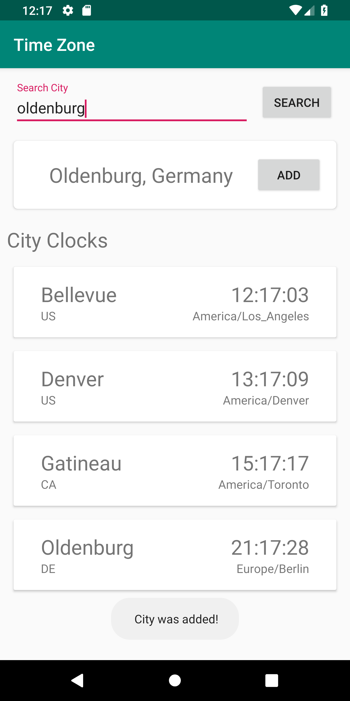

# timeZone

## Mobile Developer Take Home Challenge

### Instructions:  

**1.	Write an application that shows the current time of a list of places:**

    Bellevue, WA
    Denver, CO
    Gatineau, Quebec
    Oldenburg, Germany

Note, our preference would be to create an Xcode project for iOS, or Android Studio project for Android if you have hands-on mobile development experience. If not, any language you are most comfortable using will work great.

**2.	Modify it to get the current time from a publicly available Time Service API.**

[Google Maps Geocoding API](https://developers.google.com/maps/documentation/geocoding/start) : Get Coordinates of a City

 [TimeZoneDB](https://timezonedb.com/)  : Get the Time using Coordinates

**3.	How would you make your code testable?**

  The City Clocks List are stored in an array of City Clock Objects. An expected outcome array can be initialized. Once The recycler view is done updating, an assert equals can be implemented for each object in the array. You could check, for city, timezone and country code. You wouldn't be able to compare time

**4.	Describe some strategies for making your app performant and responsive.**

  I added performant and responsive features by implementing Recycler Views . When there's a change in data, the list will update accordingly

  I also utilized runOnUIThread methods to efficiently and safely update the recycler view adapter

### ScreenShots:  

#### Beginning
When the user first boots up the app this is what you will see. A search Input, A button and a title. It is essentially empty

#### Empty Search
If the user presses search with an empty search input they will receive a Toast at the bottom of the screen, notifying them that it cannot be empty

#### City Search
If the user searches a valid city, the app will render the most relevant searches. The user has the option to then add the this city to their __City Clocks__ List

#### Added City
If the user does press add, the city will be added to their __City Clocks__ list. It will Display the __City__, __Country Code__, __Time__, and __Time Zone__.

#### City List
The User can add as many cities they want to their __City Clock__ list. As you can see, they have the times for:

    Bellevue, WA
    Denver, CO
    Gatineau, Quebec
    Oldenburg, Germany

# Features I would have liked to add

  It was a pretty busy weekend, so I didn't get to dedicate much time to this application as I had hoped. As of now the application only displays the time when the add button was pressed. this time does not update, it remains the same.

### Live Clock
  I would have implemented a broadcast receiver that filters for the ACTION_TIME_TICK. It wold receive a broadcast when a minute goes by. Using this i would dynamically update the time for each displayed city Clock

### 12 Hour Format
  Time is currently displayed in 24 hour format. The time is a string, I would convert it to separate integers and I would have mod the hour by 12 to get the remaining value and use that for the hour.
